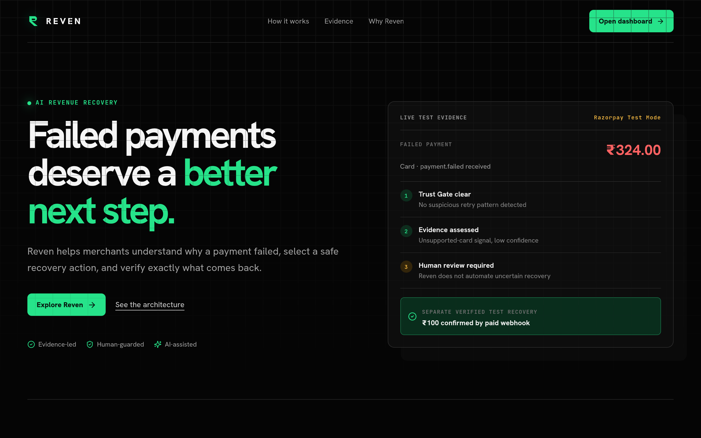

# REVEN

### Revenue recovery, under control.

**AI diagnoses. Rules decide. Razorpay proves.**

[Live app](https://reven-nine.vercel.app/) · [Open dashboard](https://reven-nine.vercel.app/home) · [API health](https://reven-api.onrender.com/health) · [Source](https://github.com/SYNTHOS7/Reven)

---

## Why Reven

When an online payment fails, a merchant sees an error code but not the right next step.

Should the customer retry? Use UPI? Receive a new payment link? Or should the merchant stop because evidence is unclear or the activity looks risky?

Reven is an evidence-first recovery system. It helps a merchant make the safest next decision for each failed payment, and it counts money as recovered only after Razorpay confirms payment.

> **Reven turns failed payments into explainable, policy-controlled recovery decisions.**

## The recovery architecture

<pre>
Razorpay payment.failed
        │
        ▼
     Detect the case
        │
        ▼
   Trust Gate ─── suspicious / over limit? ───► stop safely
        │
        ▼
AI + deterministic diagnosis
        │
        ▼
Policy decision ─── uncertain / high value? ───► human review
        │
        ▼
Approved recovery Payment Link
        │
        ▼
Razorpay payment_link.paid
        │
        ▼
Verified recovery attribution
</pre>

| Stage | What it means |
|---|---|
| **Detect** | Reven receives a signed Razorpay payment-failure event and creates a case. |
| **Trust Gate** | It checks retry history, limits, and suspicious patterns before action. |
| **Diagnose** | Payment evidence and AI identify the likely failure cause and confidence. |
| **Decide** | Policy enforces confidence, amount, retry, contact, and approval rules. |
| **Recover & Verify** | Recovery is counted only after Razorpay confirms a paid payment link. |

## Live product screenshots

  
   
  Live dashboard: guided workflow, recovery metrics, and the next best operator action.
    
  
   
  Live analysis: a clearly labelled Demo Scenario for merchant-scale recovery intelligence.

## Real Razorpay Test Mode proof

This project does not claim fabricated production revenue.

| Evidence | Verified result |
|---|---|
| Failure intake | Razorpay Test Mode sent a signed payment.failed event for a ₹324 card payment. |
| Safe decision | Reven captured the evidence and selected human review when confidence was too low. |
| Recovery | An operator-approved Razorpay Test Mode Payment Link was created. |
| Verification | Razorpay sent payment_link.paid; Reven recorded **₹100 verified Test Mode recovery**. |

Test Mode is technical proof. It does not represent production merchant revenue or real-money movement.

## Two data sources, clearly separated

### Live Razorpay Test Mode evidence

This proves the engineering loop:

<pre>
signed failure webhook → policy decision → approved recovery link → signed paid webhook
</pre>

### Simulated merchant scenario

Reven includes a clearly labelled 500-transaction online-course merchant scenario. It demonstrates how the same recovery engine can analyse leakage, prioritise cases, and model safe recovery actions at merchant scale.

**No customer is contacted and no real payment request is sent from demo data.**

## Product tour

| Page | Purpose |
|---|---|
| [Landing](/) | Explains the product, architecture, evidence, and safety approach. |
| [Home](/home) | Gives an operator the next clear action and a guided demo. |
| [Analyse](/analyse) | Shows revenue at risk, recoverable opportunity, failure patterns, and trends. |
| [Recovery Queue](/queue) | Ranks cases and explains the recommended action for each one. |
| [Evidence](/evidence) | Shows live Razorpay Test Mode cases, policy reasoning, and verified proof. |
| [Rules](/rules) | Explains and controls the safety rules around automation. |
| [Case detail](/case/rzp_pay_TSx3NFbrKdjDCr) | Shows one payment’s evidence, decision, and outcome. |

## The differentiator

<table>
  <tr>
    <td width="25%"><b>Evidence before action</b> Every recommendation starts with payment context, not a generic reminder.</td>
    <td width="25%"><b>AI bounded by policy</b> AI can interpret ambiguity but cannot bypass financial guardrails.</td>
    <td width="25%"><b>Humans handle uncertainty</b> Low-confidence and high-value cases pause for review.</td>
    <td width="25%"><b>Recovery is verified</b> A created link is an attempt. A paid webhook is proof.</td>
  </tr>
</table>

## Technology

| Layer | Technology |
|---|---|
| Web application | Next.js 16, TypeScript, CSS, Vercel |
| Recovery API | FastAPI, Python, Render |
| Payments | Razorpay Test Mode APIs and signed webhooks |
| Persistence | Supabase |
| AI diagnosis | Gemini structured diagnosis with deterministic fallback |
| Quality | Next.js production build, ESLint, Pytest |

## Run locally

<pre>
# API
cd backend
python -m venv .venv
.venv\Scripts\activate
pip install -r requirements.txt
uvicorn app.main:app --reload --port 8000

# Web application - new terminal
cd frontend
copy .env.example .env.local
npm install
npm run dev
</pre>

Add this to frontend/.env.local:

<pre>
NEXT_PUBLIC_API_URL=http://localhost:8000
</pre>

Open http://localhost:3000.

## Deployment

| Service | Root directory | Required configuration |
|---|---|---|
| Vercel | frontend | NEXT_PUBLIC_API_URL=https://your-api.onrender.com |
| Render | backend | Razorpay Test Mode keys, webhook secret, Supabase URL/service role, Gemini key, admin token |

[Deployment guide](DEPLOYMENT.md) · [API contract](docs/api-contract.md) · [Evidence plan](docs/real-data-evidence.md)

## Safety commitments

- Razorpay Test Mode only for live payment proof.
- No card numbers, CVVs, OTPs, or bank credentials are stored.
- Customer messages are previewed or simulated; they are never automatically sent.
- High-risk and uncertain recoveries require human approval.
- A Payment Link is never counted as recovered revenue.
- A signed Razorpay paid webhook is required for verified recovery.

## Demo path for judges

<pre>
Landing page
  → Open dashboard
  → Start guided demo
  → Analyse simulated revenue leakage
  → Inspect a Recovery Queue recommendation
  → Open Evidence
  → Show real ₹324 Test Mode failure + ₹100 verified Test Mode recovery
</pre>

---

  Built for <b>Razorpay AI Buildathon — Track 03: AI Revenue Recovery</b>
   
  Good payment recovery is not more automation. It is the right action, with the right evidence, at the right time.

