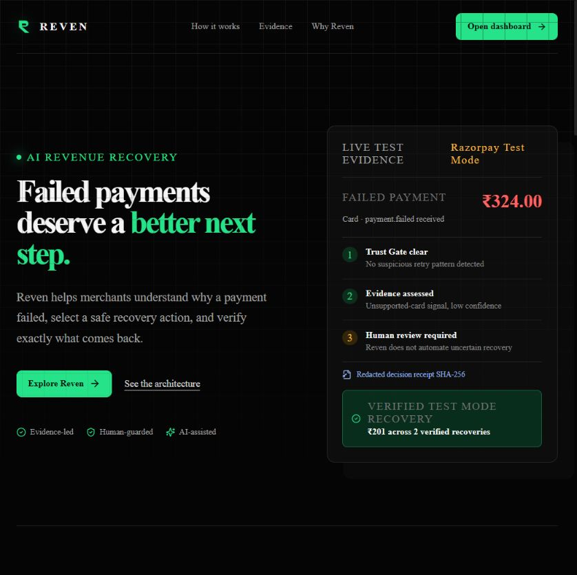
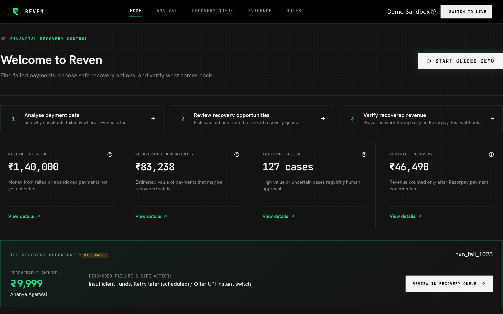
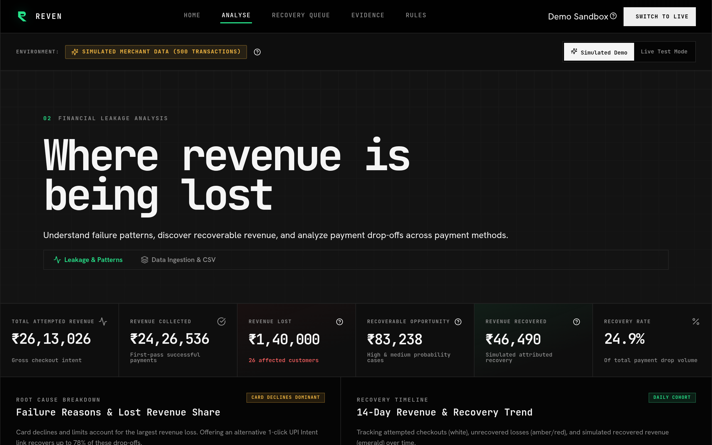

# REVEN

### Revenue recovery, under control.

**AI investigates ambiguity. Policy decides. Razorpay proves.**

[Live app](https://reven-nine.vercel.app/) · [Open dashboard](https://reven-nine.vercel.app/home) · [API health](https://reven-api.onrender.com/health) · [Source](https://github.com/SYNTHOS7/Reven)

---

## Why Reven

When an online payment fails, a merchant sees an error code but not the right next step.

Should the customer retry? Use UPI? Receive a new payment link? Or should the merchant stop because evidence is unclear or the activity looks risky?

Reven is an evidence-first recovery system. It helps a merchant make the safest next decision for each failed payment, and it counts money as recovered only after Razorpay confirms payment.

> **Reven turns failed payments into explainable, policy-controlled recovery decisions.**

## The recovery architecture

<pre>
Razorpay payment.failed
        │
        ▼
     Detect the case
        │
        ▼
   Trust Gate ─── suspicious / over limit? ───► stop safely
        │
        ▼
AI diagnosis + bounded read-only tools
        │
        ▼
Policy decision ─── uncertain / high value? ───► human review
        │
        ▼
Approved recovery Payment Link
        │
        ▼
Razorpay payment_link.paid
        │
        ▼
Verified recovery attribution
</pre>

| Stage | What it means |
|---|---|
| **Detect** | Reven receives a signed Razorpay payment-failure event and creates a case. |
| **Trust Gate** | It checks retry history, limits, and suspicious patterns before action. |
| **Diagnose** | Payment evidence and AI identify the likely failure cause and confidence. |
| **Decide** | Policy enforces confidence, amount, retry, contact, and approval rules. |
| **Recover & Verify** | Recovery is counted only after Razorpay confirms a paid payment link. |

## Live product screenshots

  
   
  Live dashboard: guided workflow, recovery metrics, and the next best operator action.
    
  
   
  Live analysis: a clearly labelled Demo Scenario for merchant-scale recovery intelligence.

## Real Razorpay Test Mode proof

### Buildathon evaluation snapshot — `buildathon-01`

This is the fixed evaluation scope used for the Buildathon story. It is separate from the live, cumulative all-Test-Mode total shown in the product.

| Metric | Result |
| --- | ---: |
| Razorpay Test Mode failed-payment cases | 32 |
| Trust Gate safety stops | 6 |
| Human-review escalations | 24 |
| Signed-webhook verified recoveries | 5 |
| Verified Test Mode recovery | ₹10,822 |
| Diagnosis agreement | 6/10 (60%) human-reviewed cases |

The diagnosis figure is early agreement evidence, **not production model accuracy**. The system does not rely on it for financial authority: Trust Gate, deterministic policy, and human approval remain separate controls.

This project does not claim fabricated production revenue.

| Evidence | Verified result |
|---|---|
| Failure intake | Razorpay Test Mode sent signed `payment.failed` events, including a ₹101 Netbanking decline. |
| Safe decision | Reven routed the ₹101 case to human review and separately blocked a repeated-attempt case through Trust Gate. |
| Recovery | An operator approved one Razorpay Test Mode Payment Link after reviewing the ₹101 case evidence. |
| Verification | Razorpay sends signed `payment_link.paid` webhooks; Reven counts only attributed completed recovery records. See the current total in the [live Evidence page](https://reven-nine.vercel.app/evidence) or [recovery-summary API](https://reven-api.onrender.com/evidence/verified-recovery). |

Test Mode is technical proof. It does not represent production merchant revenue or real-money movement.

## Two data sources, clearly separated

### Live Razorpay Test Mode evidence

This proves the engineering loop:

<pre>
signed failure webhook → policy decision → approved recovery link → signed paid webhook
</pre>

### Simulated merchant scenario

Reven includes a clearly labelled 500-transaction online-course merchant scenario. It demonstrates how the same recovery engine can analyse leakage, prioritise cases, and model safe recovery actions at merchant scale.

**No customer is contacted and no real payment request is sent from demo data.**

## Product tour

| Page | Purpose |
|---|---|
| [Landing](/) | Explains the product, architecture, evidence, and safety approach. |
| [Home](/home) | Gives an operator the next clear action and a guided demo. |
| [Analyse](/analyse) | Shows revenue at risk, recoverable opportunity, failure patterns, and trends. |
| [Recovery Queue](/queue) | Ranks cases and explains the recommended action for each one. |
| [Evidence](/evidence) | Shows live Razorpay Test Mode cases, policy reasoning, and verified proof. |
| [Rules](/rules) | Explains safety boundaries and runs a portfolio-wide no-mutation policy simulation. |
| [Case detail](/case/rzp_pay_TSx3NFbrKdjDCr) | Shows one payment’s evidence quality, AI investigation, policy decision, strategy, timeline, and fingerprint. |

## The differentiator

<table>
  <tr>
    <td width="25%"><b>Evidence before action</b> Every recommendation starts with payment context, not a generic reminder.</td>
    <td width="25%"><b>AI bounded by policy</b> AI can interpret ambiguity but cannot bypass financial guardrails.</td>
    <td width="25%"><b>Humans handle uncertainty</b> Low-confidence and high-value cases pause for review.</td>
    <td width="25%"><b>Recovery is verified</b> A created link is an attempt. A paid webhook is proof.</td>
  </tr>
</table>

## Technology

| Layer | Technology |
|---|---|
| Web application | Next.js 16, TypeScript, CSS, Vercel |
| Recovery API | FastAPI, Python, Render |
| Payments | Razorpay Test Mode APIs and signed webhooks |
| Persistence | Supabase |
| AI diagnosis | Gemini structured diagnosis with three bounded, read-only diagnostic tools and deterministic fallback |
| Quality | Next.js production build, ESLint, Pytest |

## Backend capability matrix

| Capability | What is working | Safety boundary |
|---|---|---|
| Failure intake | Signed Razorpay Test Mode `payment.failed` webhooks and batch sync | Signature verification + idempotency key |
| Diagnosis | Rule-first diagnosis; Gemini may call three read-only evidence tools for ambiguity, including a separate advisory trace | Low confidence fails closed to human review; advisory AI cannot overwrite the stored result |
| Decision | Trust Gate plus deterministic confidence, amount, retry, and contact rules | AI cannot execute a payment or override policy |
| Recovery | Operator-approved Razorpay Test Mode Payment Links | A link is not recovery; a paid webhook or reconciliation is required |
| Evidence | Readiness checklist, similar-case support, and redacted SHA-256 case fingerprint | No card, OTP, bank, or raw contact data is stored |
| Learning | Human labels and agreement / override health | Simulated data and unreviewed model outcomes are excluded |
| Merchant intelligence | Gemini may write a structured briefing from aggregate, labelled metrics; deterministic fallback keeps the same narrative available | No individual payment IDs or customer data are sent; it cannot contact customers or take action |
| Operations | Operator queue, policy impact simulator, readiness endpoint, request-size limits | Simulations are read-only and never mutate the active policy |

## Run locally

<pre>
# API
cd backend
python -m venv .venv
.venv\Scripts\activate
pip install -r requirements.txt
uvicorn app.main:app --reload --port 8000

# Web application - new terminal
cd frontend
copy .env.example .env.local
npm install
npm run dev
</pre>

Add this to frontend/.env.local:

<pre>
NEXT_PUBLIC_API_URL=http://localhost:8000
</pre>

Open http://localhost:3000.

## Deployment

| Service | Root directory | Required configuration |
|---|---|---|
| Vercel | frontend | NEXT_PUBLIC_API_URL=https://your-api.onrender.com |
| Render | backend | Razorpay Test Mode keys, webhook secret, Supabase URL/service role, Gemini key, admin token |

[Deployment guide](DEPLOYMENT.md) · [Architecture](docs/ARCHITECTURE.md) · [API contract](docs/api-contract.md) · [Evidence plan](docs/real-data-evidence.md)

## Security scope

Reven is a controlled Razorpay Test Mode operator prototype, not a multi-merchant production onboarding system. Policy edits, human labels, approvals, and reconciliation use an operator token when configured; secrets remain server-side. The deliberate v1 limits and production path are documented in [the threat model](docs/THREAT-MODEL.md).

## Safety commitments

- Razorpay Test Mode only for live payment proof.
- No card numbers, CVVs, OTPs, or bank credentials are stored.
- Customer messages are previewed or simulated; they are never automatically sent.
- High-risk and uncertain recoveries require human approval.
- A Payment Link is never counted as recovered revenue.
- A signed Razorpay paid webhook is required for verified recovery.
- An unresolved `unknown` diagnosis is hard-capped at 35% confidence and escalated; it cannot become a high-confidence action.
- Retrieval uses only same-source, human-labelled comparable cases as support for diagnosis. It never overrides policy or reuses unreviewed model guesses.

## AI and evaluation design

For ambiguous failures, Gemini must request a permitted, read-only evidence tool before it returns a structured diagnosis. The server executes the tool locally and records a redacted trace on the case.

| AI tool | What it can read | What it cannot do |
|---|---|---|
| `get_processor_context` | Current failure code, error context, payment method, bank/network and amount | Access another payment, card credentials, or customer identity |
| `get_retry_and_trust_context` | Current retry count, attempt velocity and Trust Gate thresholds | Change policy or bypass Trust Gate |
| `get_labelled_similar_cases` | Up to three same-source, human-labelled comparable cases | Reuse unreviewed model guesses or treat history as a decision |

This is a narrow retrieval and tool-calling pattern: it helps interpret evidence but does not make a financial decision. Trust Gate and deterministic policy still decide the action. No AI tool can create a Payment Link, message a customer, mutate data, or count revenue.

## Four bounded AI layers

Reven uses four small, observable AI layers rather than one autonomous agent. Each one has a restricted input and cannot move money.

| Layer | Job | Evidence it may use | What keeps it bounded |
|---|---|---|---|
| **AI Investigation Agent** | Interprets ambiguous individual payment failures | Current processor context, retry / Trust Gate signals, and up to three labelled comparable cases | Read-only tool calling; deterministic policy owns the decision |
| **Recovery Strategy Agent** | Presents 2–3 conservative recovery options | Stored diagnosis, current policy, Trust Gate outcome | Policy labels each option `allowed`, `requires_human_review`, or `blocked` |
| **Learning & Evaluation Agent** | Measures diagnosis and action agreement after review | Human-labelled Razorpay Test Mode outcomes | Simulated data, raw model guesses, and unreviewed cases are excluded |
| **Merchant Intelligence Agent** | Writes one short merchant briefing | Aggregate, labelled metrics: loss, recoverable value, patterns, and priority count | No customer-level data; cannot change policy, dispatch communication, or create a Payment Link |

The Merchant Intelligence endpoint is `POST /agents/merchant-intelligence/brief`. It uses Gemini structured output when configured and falls back to a deterministic briefing if the model is unavailable. The returned briefing includes its method and decision boundary so a judge can see exactly what generated it.

## What the hardened backend adds

- **Policy-bounded strategy:** each case exposes the next option as `allowed`, `human review`, or `blocked`; the read-only endpoint cannot execute it.
- **Recovery timeline:** shows recorded evidence and retry eligibility, never an automatic payment retry.
- **Portfolio policy simulation:** tests a candidate rule against saved Razorpay Test Mode cases using stored diagnoses, with no model call or mutation.
- **Evidence assurance:** highlights missing processor context and generates a redacted SHA-256 decision-record fingerprint for comparison.
- **Learning health:** counts only explicit human-reviewed Razorpay Test Mode labels; it excludes simulated merchant data.
- **Operator queue and readiness:** ranks open real-evidence cases deterministically and reports environment readiness without revealing secrets.

Reven intentionally does not use an autonomous multi-tool agent. A payment link is created only after policy permits it and, where required, an operator approves it. See [the evaluation protocol](docs/EVALUATION.md) for the labelling methodology and limits of reported accuracy.

## Demo path for judges

<pre>
Landing page
  → Open dashboard
  → Start guided demo
  → Analyse simulated revenue leakage
  → Inspect a Recovery Queue recommendation
  → Open Evidence
  → Show a live Test Mode case: failure → human approval → verified recovery
  → Show the current database-backed total on the Evidence page
</pre>

---

  Built for <b>Razorpay AI Buildathon — Track 03: AI Revenue Recovery</b>
   
  Good payment recovery is not more automation. It is the right action, with the right evidence, at the right time.

